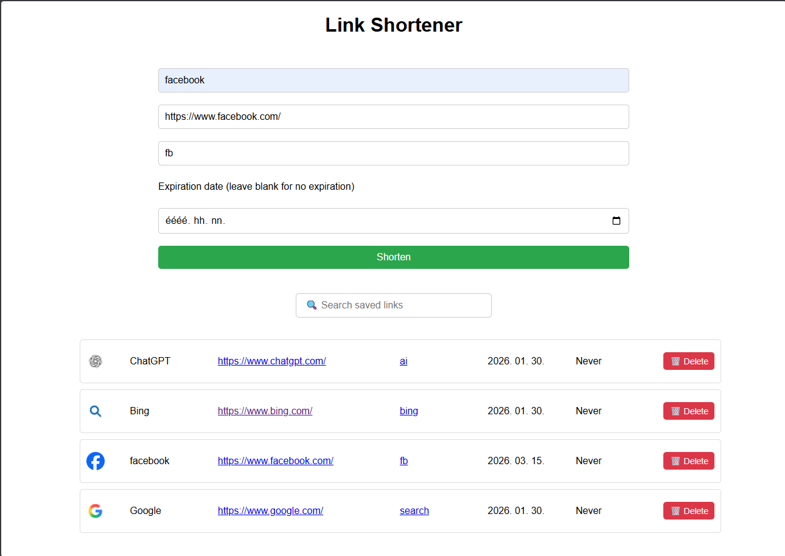

# Link-shortener

## A lightweight link shortener you can self-host or just run it on your localhost
#### Made in ExpressJS

Before installing, import the project's SQL file (link_shortener.sql) from /db to your favourite DB manager. 
#### Important: Name the database "link-shortener"
#### This is a single user application

## Installation:
```
cd link-shortener
npm install
```

## Run:
```
npm start
```

Visit localhost:3000 in your browser

Enjoy!


